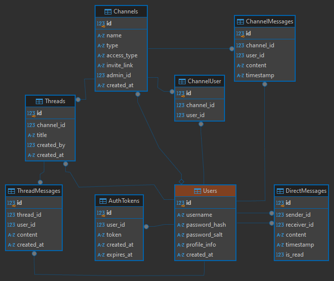

<div align="center">´


<a href=""></a> <a href=""></a>

</div>

## What is QtChatron

QtChatron is an communication application. It is a mixture of Discord, Slack and IRC. It is build using Qt 6.8.0 and C++.

## Database

As database we use SQLLite, that will be created when the server is runned. Reasons for choosing SQLite:

1. Simplitcy: we have no server setup (e.g. MySQL)
2. Portability: is a single file and therefore easy to move, backup and share
3. Lightweight and Fast: SQLite is fast and lightweight because it operates directly on files without the overhead of a client-server architecture.

### Database schema



This database schema is designed to manage users, authentication, channels, direct messages, threads, and message storage in a structured and relational manner. It includes foreign key constraints, indexing for efficient queries, and appropriate data types for scalability and performance.

### Protocol

Efficient and compact binary serialization and deserialization library for structured data, designed for seamless data transmission and storage. This protocol is used for communication between user and client.

**Structure of the protocol**

| **Field**        | **Size** | **Description**                              |
| ---------------- | -------- | -------------------------------------------- |
| `MessageType`    | 2 bytes  | Identifies the type of the message.          |
| `Name Length`    | 4 bytes  | Length of the `name` string (big-endian).    |
| `Name`           | Variable | Name string, defined by `Name Length`.       |
| `Payload Length` | 4 bytes  | Length of the `payload` string (big-endian). |
| `Payload`        | Variable | Payload data, defined by `Payload Length`.   |

This is a example for a Serialized Binary Structure:

```
| MessageType (2 bytes) | Name Length (4 bytes) | Name (variable) | Payload Length (4 bytes) | Payload (variable) |
```

This is an example of how the Protocol is used:

```cpp
Protocol protocol;
protocol.setMsgType(MessageType::COMMAND);
protocol.setName("SensorData");
protocol.setPayload("{\"temperature\": 22.5, \"humidity\": 60}");

std::string serializedData = protocol.serialize()
```

## Getting started

### 1. Clone git project

```
git clone https://github.com/MehmetMertt/qt-athon-communicator.git
```

### 2. Build server and create its exe<br>

- Open QtCreator Studio and navigate to open project.
- There choose qt-athon-communicator -> server -> CMakeLists.txt.
- To create an executable you need to change on the left sidebar on the monitor icon at the bottom from debug to release and build the project.
- The executable will be stored in /build/\*-Release directory. If deploying on windows you might need to navigate to the directory of Qt -> 6.8.0 (your version of Qt) -> mingw_64 -> bin and open here powershell or cmd and execute the command:

```
.\windeployqt <full path to executable in /build/*-Release directory>
```

Now the exe should start the application without problems.<be><br>

### 3. Build client and create its exe<br>

The steps to create an executable for the client are similiar to building the server. Here as well choose in QtCreator the Release option for building the project and open windeployqt with the argument to the newly created executable to add all necessary dependencies.
message.tx
